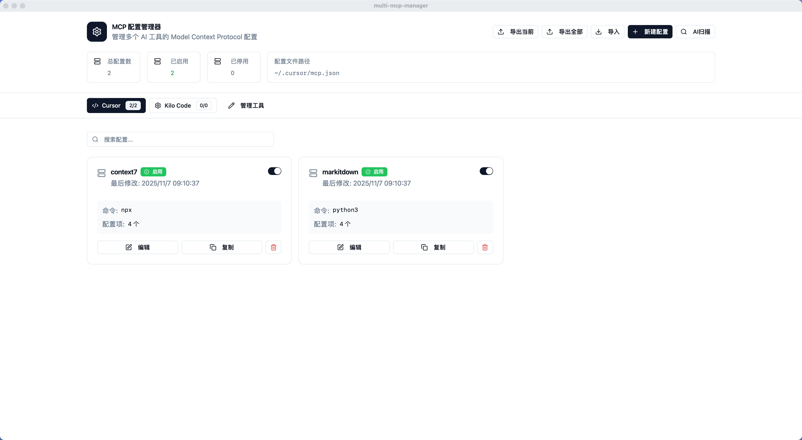
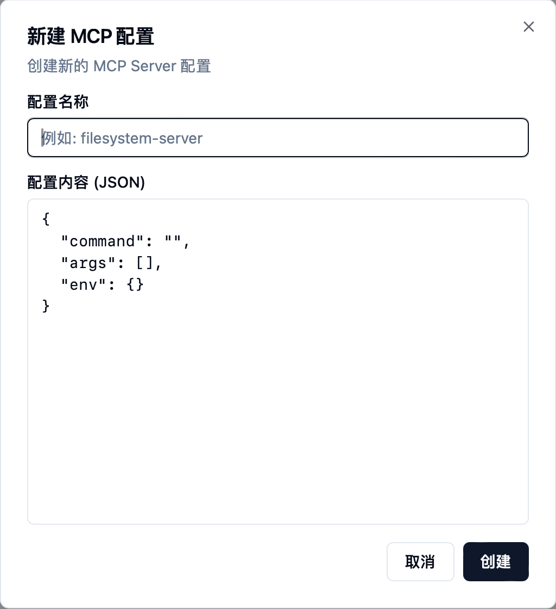
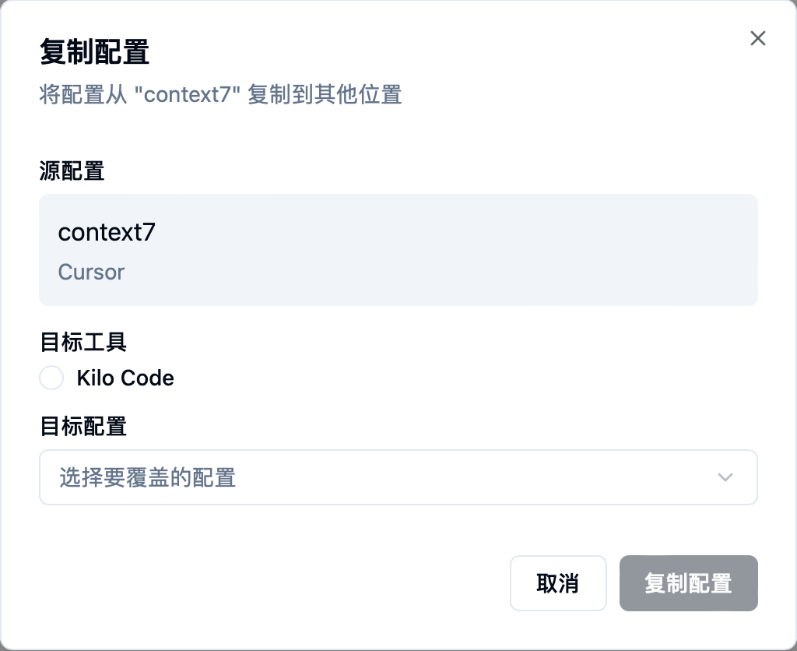
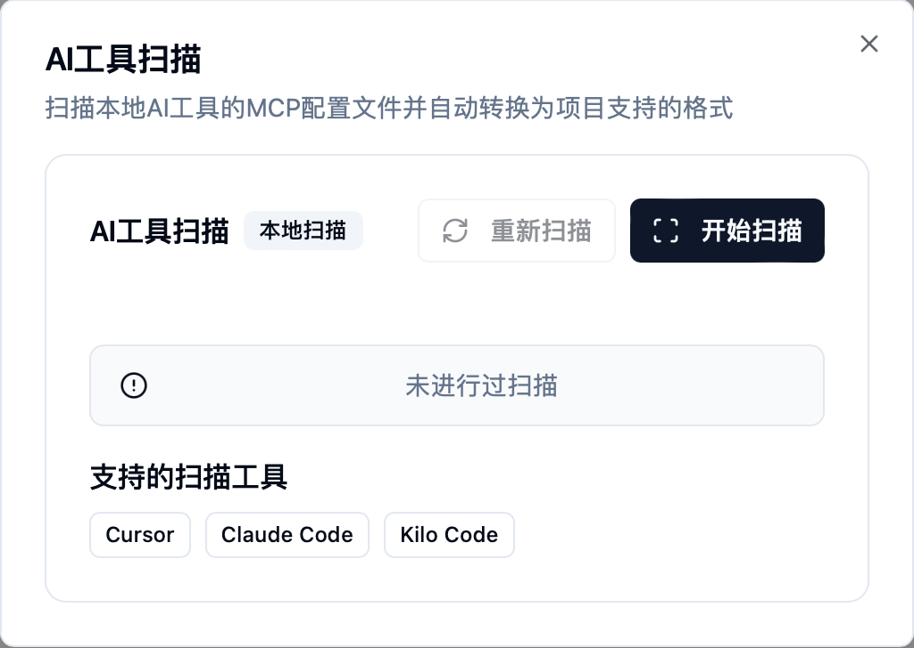
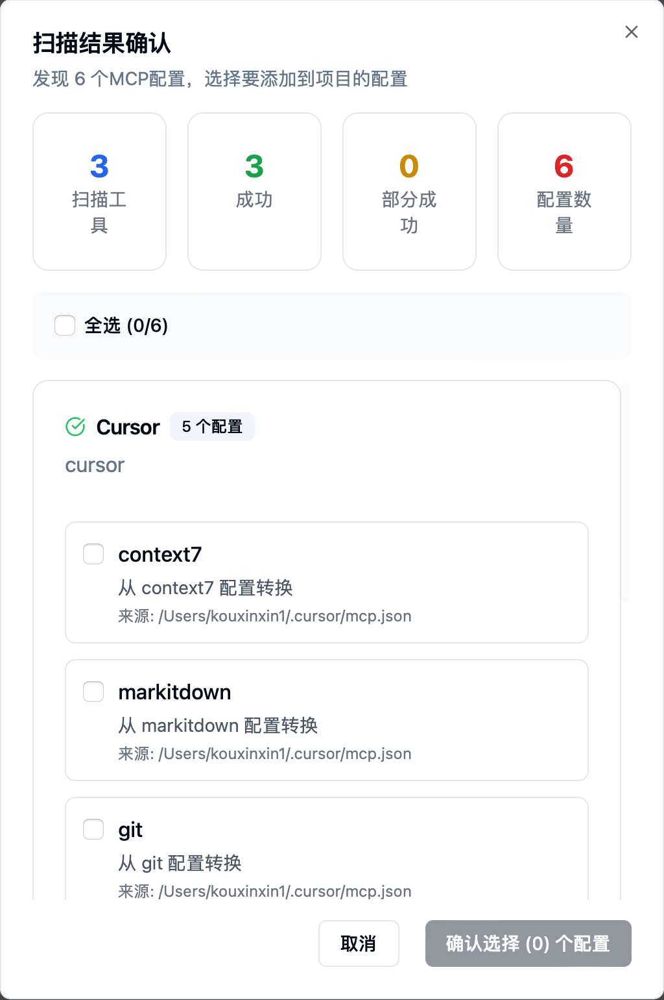
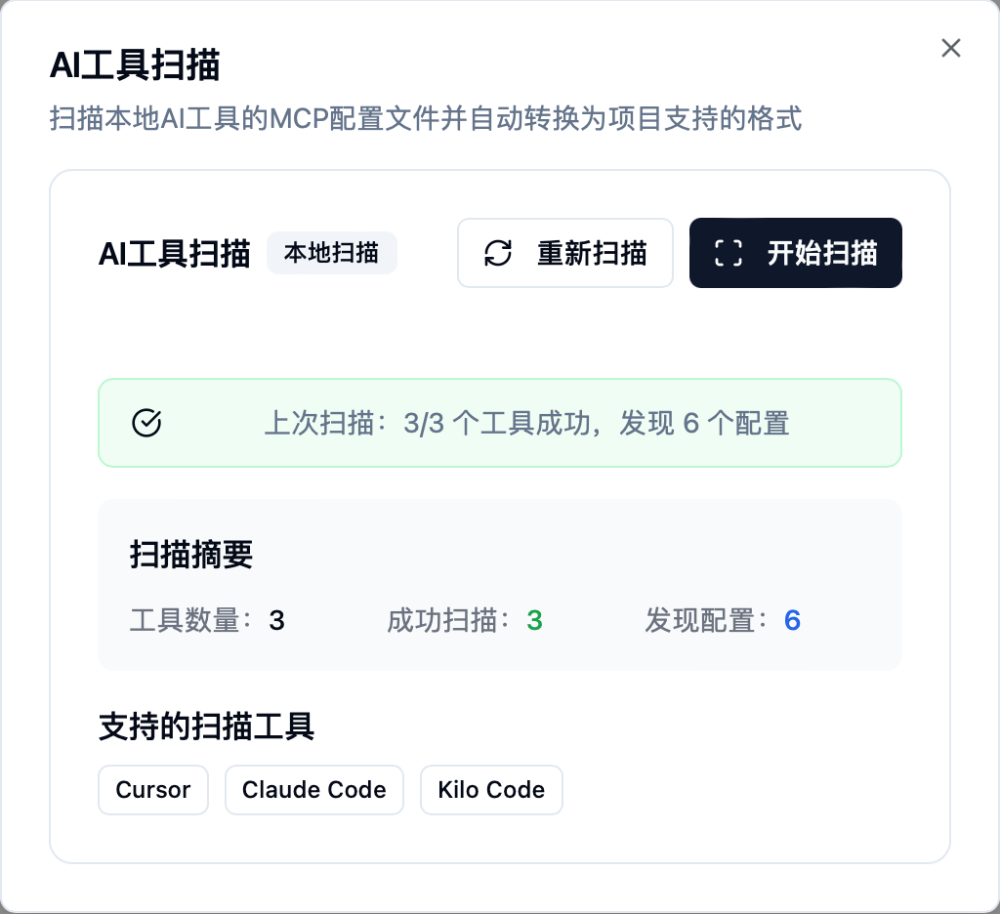

# Multi-MCP-Manager

一个基于 Tauri 和 React 的桌面应用程序，用于管理多个 AI 编程工具的 Model Context Protocol (MCP) 配置。

## 🚀 功能特性

### 核心功能

- **多工具支持**: 支持管理 Cursor、Claude Code、Kilo Code 等多种 AI 编程工具的 MCP 配置
- **配置管理**: 创建、编辑、删除和启用/禁用 MCP 配置
- **批量操作**: 支持配置的导入、导出和复制功能
- **智能搜索**: 快速搜索和过滤配置
- **本地扫描**: 自动扫描本地 AI 工具的配置文件并转换为统一格式

### 技术亮点

- **跨平台桌面应用**: 基于 Tauri 框架，支持 Windows、macOS 和 Linux
- **现代化 UI**: 使用 React 19 + Tailwind CSS + Radix UI 组件库
- **状态管理**: 使用 Zustand 进行高效的状态管理
- **类型安全**: 完整的 TypeScript 支持
- **文件操作**: 直接读写本地配置文件

## 📸 应用截图

### 主页界面



主界面展示了所有已配置的 AI 工具及其 MCP 配置列表，支持快速查看、启用/禁用配置。每个配置以卡片形式展示，包含配置名称、状态和操作按钮。

### 新建 MCP 配置



通过简洁的表单界面创建新的 MCP 配置，支持自定义配置名称和 JSON 格式的配置内容。界面提供实时验证和格式化功能，确保配置的正确性。

### 配置复制功能



一键将配置复制到其他 AI 工具，方便在不同工具间共享配置。选择目标工具后，系统会自动转换配置格式以适配目标工具。

### AI 工具扫描



自动扫描本地已安装的 AI 工具，发现现有的 MCP 配置文件。支持选择多个工具类型进行批量扫描。

### 扫描结果展示



扫描完成后，以列表形式展示发现的配置，支持预览和选择性导入。每个配置项显示工具类型、配置路径和预览内容。

### 扫描成功提示



扫描完成后显示成功提示，并自动将发现的配置转换为统一格式。导入的配置会立即显示在主界面中。

## 📋 系统要求

- Node.js 18+
- Rust (用于 Tauri 编译)
- 支持的平台: macOS 10.15+

## 🛠️ 安装和运行

### 开发环境

```bash
# 克隆项目
git clone <repository-url>
cd multi-mcp-manager

# 安装依赖
pnpm install

# 启动开发服务器
pnpm dev

# 构建桌面应用
pnpm build
pnpm tauri build
```

### 生产环境

下载并安装预编译的桌面应用程序包：

- macOS: `.dmg` 或 `.pkg` 安装包

## 📖 使用指南

### 1. 添加 AI 工具

首次使用需要先添加要管理的 AI 工具：

1. 点击右上角的"管理工具"按钮
2. 添加工具名称、图标和配置文件路径
3. 支持的工具包括 Cursor、Claude Code、Kilo Code 等

### 2. 创建 MCP 配置

创建新的 MCP 配置非常简单（参考 [新建 MCP 配置](#新建-mcp-配置) 截图）：

1. 在主页选择目标 AI 工具
2. 点击"新建配置"按钮，打开配置创建对话框
3. 填写配置名称和 MCP 配置内容（JSON 格式）
4. 保存配置并选择是否立即启用
5. 配置将显示在对应工具的配置列表中

### 3. 管理配置

在主页的配置卡片上，你可以进行以下操作：

- **启用/禁用**: 点击配置卡片右侧的开关按钮，快速启用或禁用配置
- **编辑**: 点击编辑按钮打开配置编辑器，修改配置名称和内容
- **删除**: 点击删除按钮移除不需要的配置（操作前会有确认提示）
- **复制**: 点击复制按钮，选择目标工具，一键将配置复制到其他工具（参考 [配置复制功能](#配置复制功能) 截图）

### 4. 导入导出

支持配置的批量导入导出：

- **导出配置**:
  - 点击工具栏的"导出"按钮
  - 选择导出范围（全部工具或单个工具）
  - 配置将导出为 JSON 文件，方便备份和迁移
- **导入配置**:
  - 点击工具栏的"导入"按钮
  - 选择之前导出的 JSON 文件
  - 系统会自动解析并导入配置数据

### 5. AI 工具扫描

使用内置的智能扫描功能自动发现本地 AI 工具的配置文件（参考 [AI 工具扫描](#ai-工具扫描) 截图）：

1. 点击工具栏的"AI 扫描"按钮
2. 选择要扫描的工具类型（Cursor、Claude Code 等）
3. 系统自动扫描本地配置文件路径
4. 扫描完成后，查看发现的配置列表（参考 [扫描结果展示](#扫描结果展示) 截图）
5. 预览配置内容，选择要导入的配置
6. 点击"导入选中"按钮，系统自动转换为统一格式
7. 导入成功后显示成功提示（参考 [扫描成功提示](#扫描成功提示) 截图）

> 💡 **提示**: 扫描功能会自动识别本地已安装的 AI 工具，无需手动配置路径。

## ⚠️ 已知问题

- [ ] 扫描配置保存后页面未自动刷新（疑难问题）

## 📋 开发计划

### 当前开发重点

- [ ] MCP 编辑后同步到对应的工具
- [ ] 支持自定义 AI 工具及目录扫描

### 功能 roadmap

- **短期目标 (1-2 个月)**
  - [ ] 修复配置保存后页面刷新问题
  - [ ] 完成 MCP 编辑自动同步功能

  - [ ] 支持自定义 AI 工具配置
  - [ ] 增强目录扫描功能

- **长期目标 (6-12 个月)**
  - [ ] 学习 React 和 Rust 技术栈，对整个项目进行深度优化

## 🗂️ 项目结构

```text
multi-mcp-manager/
├── src/
│   ├── components/          # React 组件
│   │   ├── ConfigCard.tsx   # 配置卡片组件
│   │   ├── ConfigEditor.tsx # 配置编辑器
│   │   ├── ToolManager.tsx  # 工具管理器
│   │   └── ToolScanToolbar.tsx # 扫描工具栏
│   ├── hooks/              # 自定义 Hooks
│   │   ├── useMCPManager.ts # MCP 管理核心逻辑
│   │   └── useLocalToolScanner.ts # 本地工具扫描
│   ├── services/           # 业务服务
│   │   ├── MCPConfigService.ts # 配置服务
│   │   └── LocalToolScannerService.ts # 本地扫描服务
│   ├── types/              # TypeScript 类型定义
│   └── data/               # 静态数据
│       └── default-configs.ts # 默认配置
├── src-tauri/             # Tauri 原生代码
│   ├── src/
│   │   ├── lib.rs         # Tauri 应用配置
│   │   └── main.rs        # 主函数
│   └── Cargo.toml         # Rust 依赖配置
└── package.json           # Node.js 依赖配置
```

## 🔧 开发指南

### 添加新工具支持

1. 在 `src/data/default-configs.ts` 中添加工具定义
2. 在 `EXTENDED_TOOL_SCAN_CONFIGS` 中配置扫描路径
3. 更新 `src/types/index.ts` 中的类型定义

### 添加新功能

1. 创建新的 React 组件在 `src/components/` 目录
2. 添加相应的 Hook 在 `src/hooks/` 目录
3. 如果需要原生功能，在 `src-tauri/src/commands/` 添加 Rust 函数
4. 更新 `src-tauri/tauri.conf.json` 添加新的 API 权限

### 测试

```bash
# 运行单元测试
pnpm test

# 运行 E2E 测试
pnpm test:e2e

# 代码检查
pnpm lint

# 代码格式化
pnpm format
```

## 🤝 贡献指南

1. Fork 本仓库
2. 创建功能分支 (`git checkout -b feature/AmazingFeature`)
3. 提交更改 (`git commit -m 'Add some AmazingFeature'`)
4. 推送到分支 (`git push origin feature/AmazingFeature`)
5. 打开 Pull Request

## 📄 许可证

本项目采用 MIT 许可证 - 查看 [LICENSE](LICENSE) 文件了解详情

## 🙏 致谢

- [Tauri](https://tauri.app/) - 跨平台桌面应用框架
- [React](https://reactjs.org/) - 用户界面库
- [Tailwind CSS](https://tailwindcss.com/) - 实用优先的 CSS 框架
- [Radix UI](https://www.radix-ui.com/) - 无样式的组件库
- [Zustand](https://zustand-demo.pmnd.rs/) - 轻量级状态管理

## 📞 联系方式

如有问题或建议，请通过以下方式联系：

- 提交 Issue: [GitHub Issues](https://github.com/Klien-m/Multi-MCP-Manager/issues)

---

**Multi-MCP-Manager** - 让 MCP 配置管理更简单 🚀
